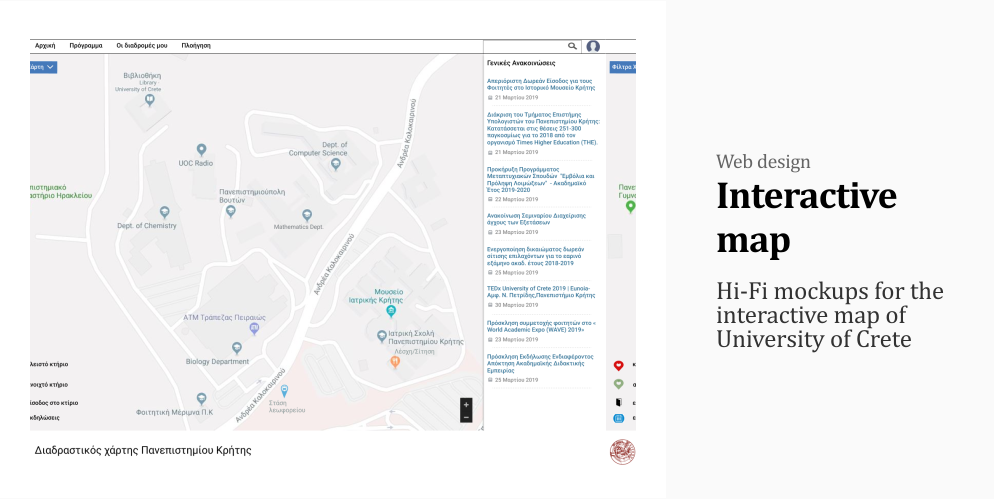

# UOC Interactive map

Designing the interactive map of University of Crete

## About
The low and high fidelity mockups were created using the Figma design tool and are based upon the fundamental principles of Human - Computer Interaction.
Mockups were designed for both desktop and mobile.

## Contributors
This project was a group project for the Human - Computer Interaction course of the Computer Science department. 

